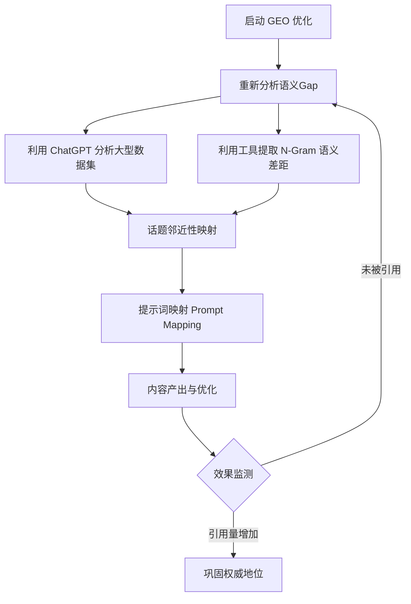

# 生成式引擎优化 (Generative Engine Optimization, GEO) 深度策略指南

生成式引擎优化（GEO）是一套旨在让内容在 AI 生成的搜索结果（如 Google AI 概览、ChatGPT、Perplexity）中变得**可检索（Retrievable）**、**可重排（Re-rankable）**且**具有引用价值（Reference-worthy）**的实践方法。

---

## 1. GEO 的核心定义与目标

不同于传统 SEO 追求关键词排名（SERP），GEO 围绕大语言模型（LLM）获取、过滤和合成信息的方式构建。

*   **核心目标**：确保品牌内容在 AI 的回答中被直接引用（Cited）、作为事实依据（Grounded）并获得用户信任（Trusted）。
*   **本质转变**：从“点击率导向”转向“被引用与合成导向”。

---

## 2. 三大核心支柱战略

### 2.1 扩大语义足迹 (Expanding Semantic Footprint)
*   **策略**：通过发布新内容和优化现有页面，覆盖更广泛的**话题集群（Topic Clusters）**。
*   **逻辑**：AI 不再只看单一关键词。利用“查询扇出（Query Fan-out）”技术，将用户意图扩展到多个相关实体。内容覆盖面越广，被 AI 关联并推荐的机会越大。

### 2.2 提高事实密度 (Increasing Fact-Density)
*   **策略**：专注于增加统计数据、引用文献和独特见解。
*   **逻辑**：AI 奖励“信息增益（Information Gain）”。结构化、模块化的内容（如 FAQ、指南、深度研究报告）更易于被 LLM 提取。

### 2.3 强化结构化数据 (Enhancing Structured Data)
*   **策略**：深度利用 Schema.org 标记、商家数据馈送（Merchant Feeds）和实体数据集。
*   **逻辑**：结构化数据是 AI 进行“事实锚定（Grounding）”的直接索引，能大幅降低 AI 生成幻觉的概率。

---

## 3. 商业价值与案例影响

根据案例研究，GEO 的实施能带来显著的转化提升：

| 指标维度 | 提升幅度 |
| :--- | :--- |
| **AI 驱动流量增长** | +43.00% |
| **AI 推荐转化率提升** | +83.33% |
| **线索转化率对比** | AI 驱动线索比传统搜索高 **25 倍** |

---

## 4. 实施方法论与路线图

### 关键步骤：
1.  **提示词映射 (Prompt Mapping)**：反向工程用户可能的提问方式，并针对性设计回答。
2.  **基准测试 (Benchmarking)**：分析目前 AI 已引用的竞争对手，识别其内容特征。
3.  **查询扇出扩展 (Query Fan-out)**：从核心查询延伸到边缘的长尾问题。

---

## 5. 核心术语解析与中英对照

### 技术术语 (Technical Terms)
*   **Query Fan-out (查询扇出)**: AI 将简单问题扩展为多个相关语义问题的过程。
*   **Information Gain (信息增益)**: 网页提供的高于互联网平均水平的新事实或独特见解。
*   **Grounding (事实锚定/接地)**: AI 模型将生成内容与真实世界数据（如你的网页）联系起来以减少幻觉的过程。
*   **Topic Adjacency Mapping (话题邻近性映射)**: 寻找与核心业务逻辑相关、但尚未被覆盖的边缘话题。

### 维度对比 (Core Dimensions)
| 维度 (Dimension) | 英文原文 (Original Text) | 中文翻译 (Chinese Translation) |
| :--- | :--- | :--- |
| **定义** | Retrievable, re-rankable, and reference-worthy. | 可检索、可重排、具有引用价值。 |
| **重排序器** | Rerankers reward authoritative passages over shallow sections. | 重排序器更青睐详尽且权威的段落而非肤浅片段。 |
| **关键差距** | The most significant gap lies at the prompt level. | 目前最大的差距在于对“提示词层级”的洞察。 |

---

## 6. 参考来源 (Sources)

*   [Go Fish Digital: GEO Strategy Guide](https://gofishdigital.com)
*   [Google Patent US11769017B1 (Query Expansion)](https://patents.google.com/patent/US11769017B1/en)
*   [Information Gain Patent WO2024064249A1](https://patents.google.com/patent/WO2024064249A1/en)

---

## 7. 待办事项 (Implementation TODOs)

- [ ] **语义足迹审计**：识别当前业务的核心话题集群，找出尚未覆盖的语义缺口。
- [ ] **事实密度提升计划**：
    - [ ] 收集并整理业务相关的行业数据、统计报告。
    - [ ] 在核心落地页中增加引用来源、专家见解和 FAQ 模块。
- [ ] **结构化数据升级**：
    - [ ] 检查并更新全站的 Schema.org 标记（如 Product, Organization, FAQPage）。
    - [ ] 确保 Merchant Feeds 数据同步且字段完整。
- [ ] **AI 提问反向工程 (Prompt Mapping)**：
    - [ ] 模拟用户在 ChatGPT/Google AI 中搜索品牌相关问题的 Prompt。
    - [ ] 针对这些 Prompt 优化网页段落的“回答性”。
- [ ] **竞品基准分析**：观察目前 AI 优先引用哪些竞品内容，分析其“信息增益”来源。
- [ ] **查询扇出扩展**：将核心业务关键词扩展为至少 10-20 个长尾语义问题。

